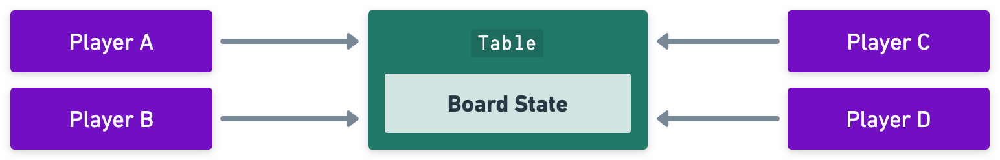
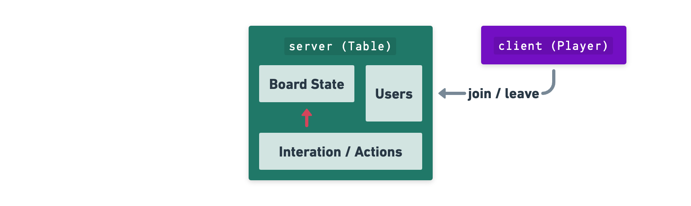
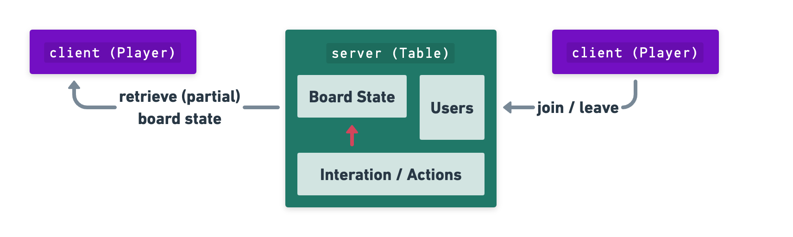
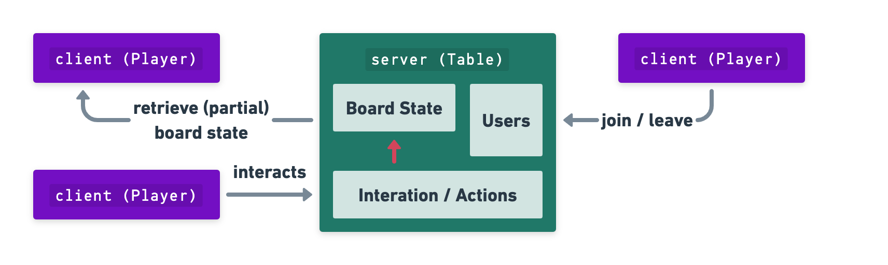
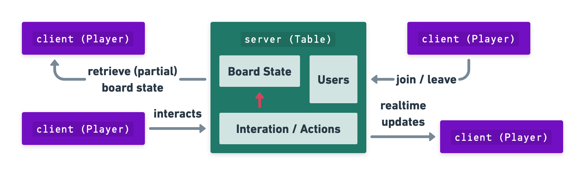
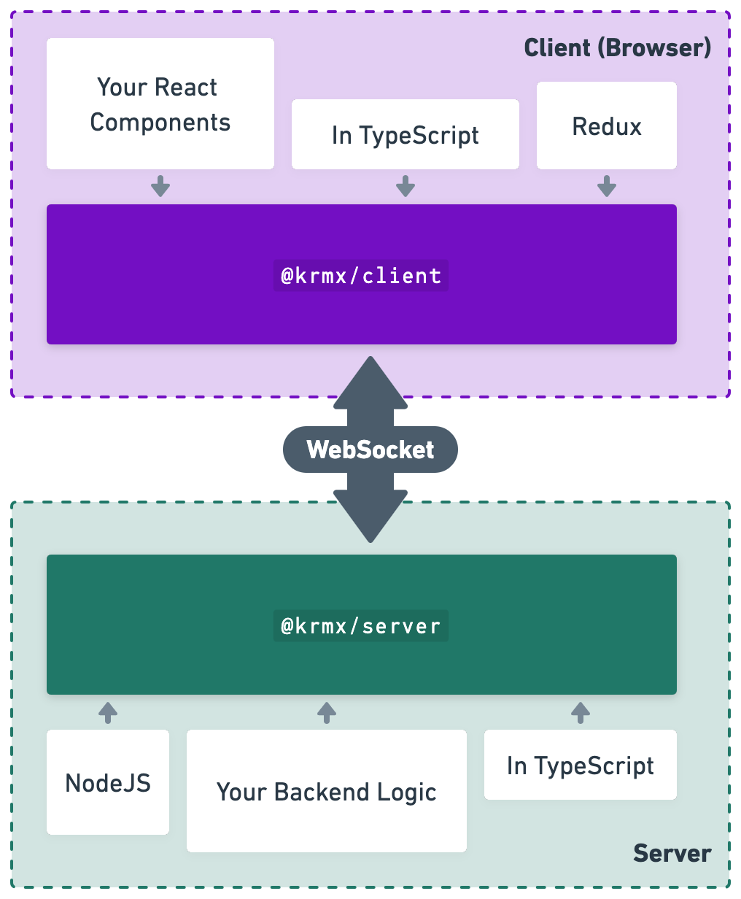
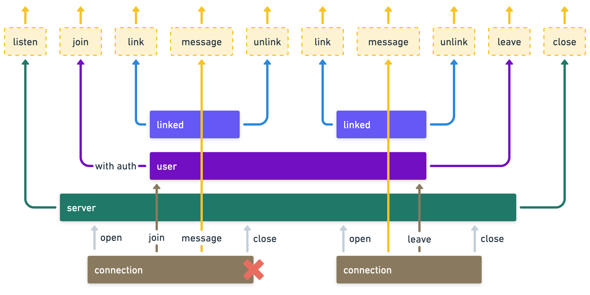
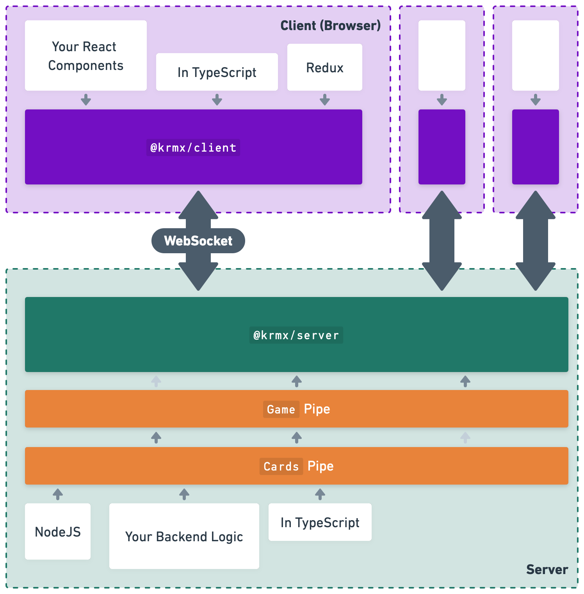

# WebSockets for Turn-Based Multiplayer Games
24th of  August 2023

Simon Karman @ AdvancedJS meetup AMS

<style>
.slidev-layout.cover h1 {
    max-width: 20rem;
    font-size: 1.5rem;
}
</style>

<!--
Live coding of a simple turn-based game using a TypeScript NodeJS backend and a Typescript React frontend using the krmx library. Krmx is a custom WebSocket protocol specifically build for user-based applications such as turn based games with NodeJS backends and React frontends.
-->

---

# Who am I?

<div class="float-right w-48">
  
  <p class="text-center">Simon Karman</p>
</div>

💼 Cloud Consultant @ Xebia Cloud

-- 

🕹️ Hobbyist Game Developer
- Since primary school
- Making > Playing
- Board games

--

🌎 Building a multiplayer board game

<!--
I work at Xebia as a Cloud Consultant. In my free time I'm a hobbyist game developer. I love boardgames and especially making them. Since I was a kid. During covid trying to combine cloud/internet with games. Resulted in some multiplayer games for a group of friends (b11 party) which was 'Mario Party'-ish.
-->

---

# Board game
Let's start at the basis. What is a board game?

- Table and Players
- Players can look at the board state on the table (cards, pieces, dice, ect...)
- Players can take actions asynchronously
- Players have imperfect information of the board state



---
clicks: 4
---

# Online multiplayer game
A board game over the internet!

<div v-if="$slidev.nav.clicks === 0"></div>
<div v-if="$slidev.nav.clicks === 1"></div>
<div v-if="$slidev.nav.clicks === 2"></div>
<div v-if="$slidev.nav.clicks === 3"></div>
<div v-if="$slidev.nav.clicks === 4"></div>

---

# Software Complexity
How well do multiplayer games align with development best practices?

| **Best Practice**    | **What we need**                |
|----------------------|---------------------------------|
| Co-located System    | ❌ Distributed System            |
| Stateless            | ❌ Stateful (hidden information) |
| Synchronous          | ❌ Asynchronous                  |
| Eventual Consistency | ❌ Realtime                      |

<div v-click class="mt-10 text-2xl">
  <b>Conclusion</b>: creating an online multiplayer board game is complex!
</div>

---



# Krmx
A network protocol for realtime multi-user interactions.


<v-clicks>

- Distributed System ✅: Uses a clients and server architecture out of the box
- Stateful ✅: Keeps track of all-knowing state (server) and per player state (client)
- Asynchronous ✅: Allows users to interact over time
- Realtime ✅: Informs users in realtime via WebSockets

- Warning ⚠️: Created by me

</v-clicks>

---
layout: iframe
url: http://hexlines.simonkarman.com:3000/
---

# Demo
This page is hidden as the iframe takes up the whole page.

---


# Krmx Implementation
What is Krmx in its core?

- Server
- Client
- Event Emitter
- Store state at server
- WebSockets for realtime updates

---
 
# Krmx Protocol
Event Emitter at its core.



---

# Krmx Protocol - Events
It's all just events

```json5 {1|2|3|4|all}
{ type: string, payload: object }
{ type: "user/joined", payload: { username: "simon" } }
{ type: "user/linked", payload: { username: "simon" } }
{ type: "custom/create-spawned", payload: { class: "dragon", power: 10 } }
```

---

# Customization
Use middleware to add your own functionality.



---
layout: iframe
url: https://simonkarman.github.io/krmx
---

# Documentation
This page is hidden as the iframe takes up the whole page.

---

# Live Coding!
Let's build a simple Krmx Server and Client setup.

- Krmx is a Protocol
- Reference implementation of client and server provided
- TypeScript
- React / Redux

---

# Thanks! Questions?
That's it!

<div class="float-right w-48">
  
  <p class="text-center">Simon Karman</p>
  <p class="text-center">simon.karman@xebia.com</p>
</div>

<p class="max-w-2/3">
  If you would like to play hexlines, you can join at: <a target="_blank" href="http://hexlines.simonkarman.com:3000/">http://hexlines.simonkarman.com:3000/</a> (Note: only 6 players can participate, be quick!)
</p>
