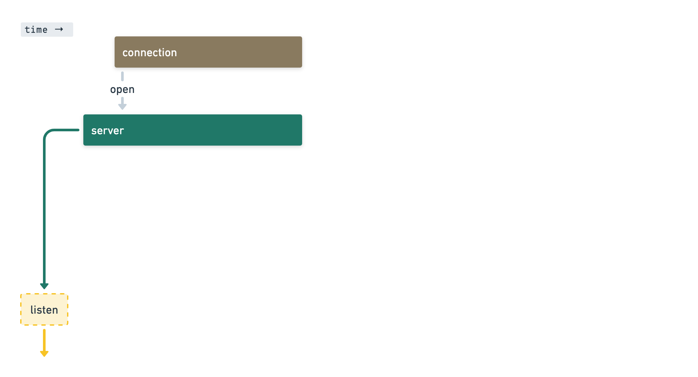
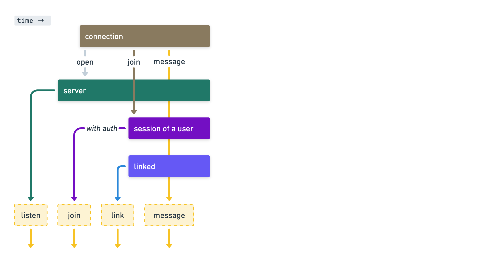
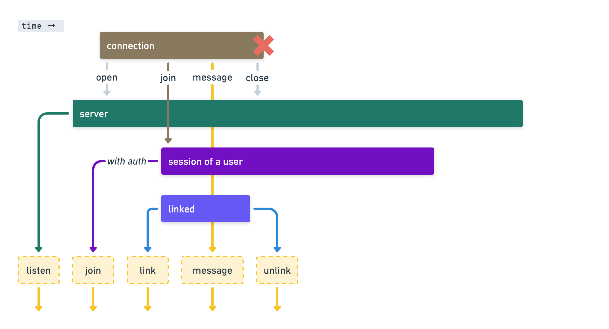
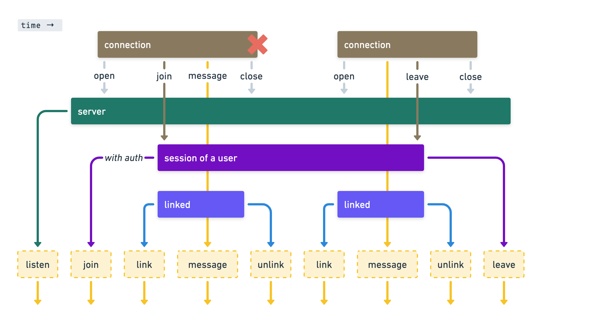
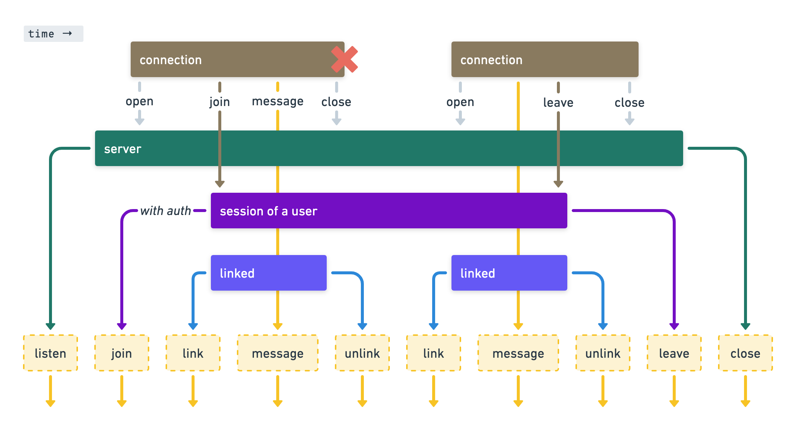
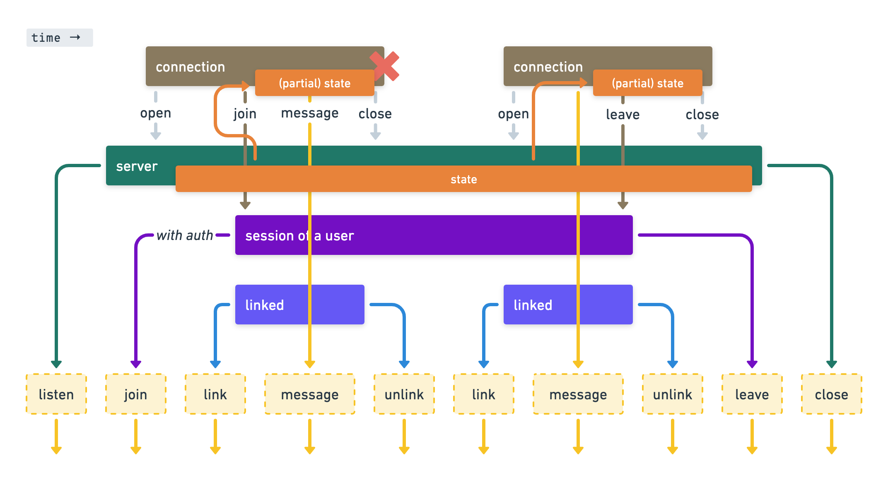

# WebSockets for Turn-Based Multiplayer Games
24th of August 2023 @ AdvancedJS Meetup

Simon Karman (www.simonkarman.nl)

<div class="flex gap-8">
<div class="w-24">
  
</div>
<div>

💼 Xebia Cloud Consultant 

🕹 (Hobbyist) Game Developer

</div>
</div>


<style>
.slidev-layout.cover h1 {
    margin-top: 4rem;
    max-width: 20rem;
    font-size: 1.5rem;
}
</style>

<!--
Verify: Clock in sight or timer on table!

Live coding of a simple turn-based game using a TypeScript NodeJS backend and a Typescript React frontend using the krmx library. Krmx is a custom WebSocket protocol specifically build for user-based applications such as turn based games with NodeJS backends and React frontends.

I work at Xebia as a Cloud Consultant. In my free time I'm a hobbyist game developer. I love boardgames and especially making them. Since I was a kid. During covid trying to combine cloud/internet with games. Resulted in some multiplayer games for a group of friends (b11 party) which was 'Mario Party'-ish.
-->

---

# Let's start at the basics
What is a board game?

- Table and players
- Players can look at the board state on the table (cards, pieces, dice, ect...)
- In some games, players have imperfect information of the board state
- Players can take actions


---
clicks: 4
---

# A board game over the internet
Building a framework for an online multiplayer game

<div v-if="$slidev.nav.clicks === 0"></div>
<div v-if="$slidev.nav.clicks === 1"></div>
<div v-if="$slidev.nav.clicks === 2"></div>
<div v-if="$slidev.nav.clicks === 3"></div>
<div v-if="$slidev.nav.clicks === 4"></div>

---

# What we need
A system that is ...

<v-clicks class="text-md">

- Distributed ✅ -- An architecture with a server and multiple clients
- Stateful ✅ -- Keeps track of all state at the server and (partial) state on the client
- Realtime ✅ -- Informs users in realtime via WebSockets
- Asynchronous ✅ -- Allows users to interact over time using a persisted session

</v-clicks>
<v-clicks class="text-md">

**Conclusion**: Creating an online multiplayer board game is complex!

</v-clicks>

---


# Krmx
A network protocol for realtime multi-user interactions

<v-clicks class="text-md">

<div class="my-12 text-lg w-full text-center">

🚨 Disclaimer: Krmx is a pet project by me❗

</div>

</v-clicks>
<v-clicks class="text-md">

- Fun 🎉
- Simple API ✅ -- Clear and concise API specification on both client and server side
- Automated Tests ✅ -- Test coverage (100%) on 65 different scenarios

</v-clicks>

<!--
Disclaimer points: Fun! & C# before & Tests!
-->

---
layout: iframe
url: http://hexlines.simonkarman.com:3000/
---

# Demo
This page is hidden as the iframe takes up the whole page.

---
clicks: 5
---

# Krmx Protocol
A diagram of the Krmx protocol interaction with a client over time

<div v-if="$slidev.nav.clicks === 0"></div>
<div v-if="$slidev.nav.clicks === 1"></div>
<div v-if="$slidev.nav.clicks === 2"></div>
<div v-if="$slidev.nav.clicks === 3"></div>
<div v-if="$slidev.nav.clicks === 4"></div>
<div v-if="$slidev.nav.clicks === 5"></div>


<!--
- Protocol
- Event Emitter
- Client and Server Side
- Store state at server
- Keeps track of user sessions
- WebSockets for realtime updates
-->

---

# Type & Payload
The structure of all events in the protocol

```json5 {1|3|5|7|all}
{ type: string, payload: object }

{ type: "user/joined", payload: { username: "simon" } }

{ type: "user/linked", payload: { username: "simon" } }

{ type: "my-game/creature-spawned", payload: { class: "dragon", power: 10 } }
```

---


# Reference Implementations
--

TypeScript React **Client** Reference Implementation

```bash
npm install @krmx/client
```

--

Typescript NodeJS **Server** Reference Implementation

```bash
npm install @krmx/server
```

---
layout: iframe
url: https://simonkarman.github.io/krmx
---

# Documentation
This page is hidden as the iframe takes up the whole page.

---

# Live Coding!
Let's build a simple Krmx server and client architecture


---

# Customization
Use middleware to add your own functionality


---

# Upcoming features


- State management
- Latency
- Officially support Game Middleware
- ... more!

Want to help? Go to **github.com/simonkarman/krmx**

---

<div class="flex flex-col items-center float-right w-64">
  
  <p class="text-center font-bold">Simon Karman</p>
  <p class="text-center">simon.karman@xebia.com</p>
  <p class="text-center">www.simonkarman.nl</p>
  <p class="text-center">github.com/simonkarman/krmx</p>
</div>

# Thank you! Questions?


<p class="max-w-2/3 text-sm">
  During the break you can play hexlines at
  <a target="_blank" href="http://hexlines.simonkarman.com:3000/">http://hexlines.simonkarman.com:3000/</a>
</p>
