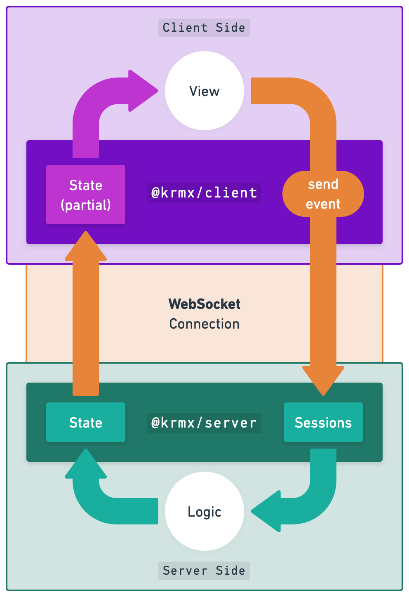

# WebSockets for Turn-Based Multiplayer Games
24th of  August 2023

Simon Karman @ AdvancedJS meetup AMS

<!--
Live coding of a simple turn-based game using a TypeScript NodeJS backend and a Typescript React frontend using the krmx library. Krmx is a custom WebSocket protocol specifically build for user-based applications such as turn based games with NodeJS backends and React frontends.
-->

---

# Who am I?

  
  
Simon Karman

💼 Cloud Consultant @ Xebia Cloud

-- 

🕹️ Hobbyist Game Developer
- Since primary school
- Making > Playing
- Board games

--

🌎 Building a multiplayer board game

<!--
I work at Xebia as a Cloud Consultant. In my free time I'm a hobbyist game developer. I love boardgames and especially making them. Since I was a kid. During covid trying to combine cloud/internet with games. Resulted in some multiplayer games for a group of friends (b11 party) which was 'Mario Party'-ish.
-->

---

# Board game
Let's start at the basis. What is a board game?

- Table and Players
- Players can look at the board state on the table (cards, pieces, dice, ect...)
- Players can take actions asynchronously
- Players have imperfect information of the board state

---
clicks: 4
---

# Online multiplayer game
A board game over the internet!

---

# Software Complexity
How well do multiplayer games align with development best practices?

| **Best Practice**    | **What we need**                |
|----------------------|---------------------------------|
| Co-located System    | ❌ Distributed System            |
| Stateless            | ❌ Stateful (hidden information) |
| Synchronous          | ❌ Asynchronous                  |
| Eventual Consistency | ❌ Realtime                      |

  <b>Conclusion</b>: creating an multiplayer board game is complex!

---

# Krmx
A network protocol for realtime multi-user interactions.

<v-clicks>

- Distributed System ✅: Uses a clients and server architecture out of the box
- Stateful ✅: Keeps track of all-knowing state (server) and per player state (client)
- Asynchronous ✅: Allows users to interact over time
- Realtime ✅: Informs users in realtime via WebSockets

- Warning ⚠️: Created by me

</v-clicks>

---
layout: iframe
url: http://hexlines.simonkarman.com:3000/
---

# Demo
This page is hidden as the iframe takes up the whole page.

---

# Krmx Implementation
krmx = (event emitter + redux) + websockets networking

---

 
# Krmx Events 
events emitted and example of krmx on client side and server side

---

# Customization
middleware/ layers to add functionality

---
layout: iframe
url: https://simonkarman.github.io/krmx
---

# Documentation
This page is hidden as the iframe takes up the whole page.

---

# Live Coding!
manipulate some stuff to build a cool new feature

---

# Thanks! Questions?

Want to play some more hexlines? Join at: http://hexlines.simonkarman.com:3000/

> Note: only 6 players can participate, be quick!
